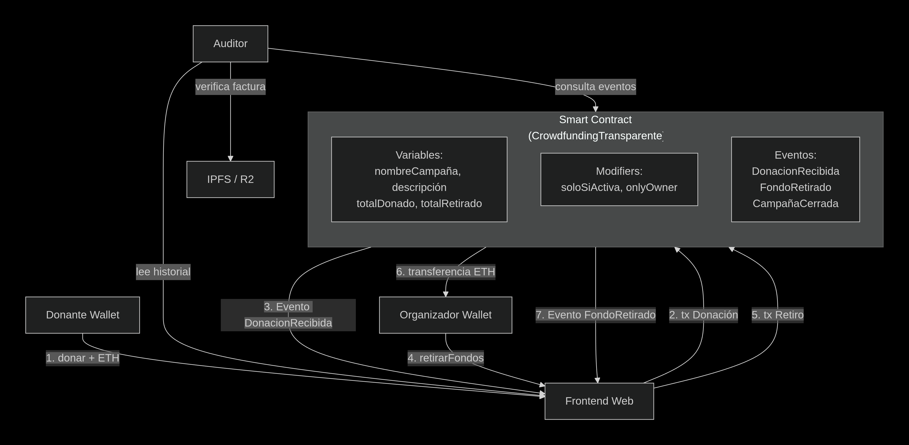

  

# Plataforma de donaciones públicas e inmutables

|           |                                                               |
| --------- | ------------------------------------------------------------- |
| **Autor** | Miguel Angel Gafe                                             |
| **Curso** | Introducción a Ethereum y Solidity  - ETH KIPU - TALENTO TECH |
| **Track** | Finanzas Descentralizadas (DeFi)                              |

**Repositorio**
[https://github.com/miguelangelgafe/Introduccion-a-Ethereum-y-Solidity---ETH-KIPU](https://github.com/miguelangelgafe/Introduccion-a-Ethereum-y-Solidity---ETH-KIPU)

---

\thispagestyle{empty}  
\newpage

\pagenumbering{arabic}
\setcounter{page}{1}

## **1. Definición del Problema**

Las campañas de donación tradicionales (bancos, mercadopago, transferencias bancarias) operan bajo un modelo de **confianza ciega**. El donante transfiere dinero a una cuenta privada y no tiene ninguna garantía de que los fondos sean utilizados para el fin declarado. Esta opacidad genera múltiples ineficiencias:

- **Falta de transparencia total:** El organizador puede recaudar más dinero del declarado públicamente. No existe un libro contable auditable por terceros.
- **Desvío de fondos no detectable:** Sin un registro público de gastos, un mal actor puede utilizar el dinero para fines personales sin que los donantes puedan demostrarlo fehacientemente.
- **Desconfianza sistémica:** La proliferación de fraudes en campañas solidarias quita la voluntad de donar del público general.
- **Alta fricción y costos de auditoría:** Si un donante quiere verificar el uso de los fondos, debe contratar un contador o solicitar informes internos al organizador, lo cual es lento, costoso y no garantiza la veracidad.

## **2. Propuesta de Valor**

La plataforma propuesta, resuelve estos problemas utilizando la infraestructura de Ethereum para crear un **libro contable público, inmutable y automatizado** de toda la vida financiera de una campaña.

- **Transparencia radical:** Cada donación (donante, monto, timestamp, mensaje) queda registrada públicamente en la blockchain. Cualquier persona puede ver el saldo actual del contrato en tiempo real.
- **Rendición de gastos forzosa:** El organizador (solo él) puede retirar fondos, pero cada retiro debe incluir una justificación obligatoria . El historial de retiros es público e inmutable.
- **Auditabilidad:** No se necesitan contadores ni intermediarios. La blockchain misma actúa como el verificador universal. Un donante puede consultar cuánto dinero entró, cuánto salió y en qué se gastó.
- **Automatización de reglas:** El contrato puede extenderse para incluir votaciones de donantes, aprobación múltiple de gastos (DAOs), o liberación escalonada de fondos por hitos.

**¿Por qué blockchain y no una base de datos tradicional?**

| Característica                     | Base de datos centralizada (ej. SQL) | Plataforma Desc.(Ethereum)            |
| ---------------------------------- | ------------------------------------ | ------------------------------------- |
| Registros inmutables               | El admin puede modificarlos          | Imposible de alterar                  |
| Acceso público                     | Solo si el dueño lo permite          | Siempre público                       |
| Verificabilidad sin intermediarios | Necesitás creerle al dueño           | Cualquiera audita                     |
| Costo de operación                 | Bajo (servidor)                      | Bajo en L2 / moderado en Mainnet      |
| Resistencia a censura              | El dueño borra                       | El contrato permance en la BlockChain |

## **3. Arquitectura del Sistema**

### **Capa de Smart Contracts**

El contrato inteligente `DonacionesTransparente` actúa como una **caja fuerte pública y auditable**. No guarda datos redundantes ni hace cálculos pesados; solo registra donaciones y retiros de forma ordenada e inmutable.

**Variables de estado:**
- `nombreCampaña` y `descripcion`: metadatos de la causa.
- `activa`: booleano que permite o no nuevas donaciones.
- `totalDonado` y `totalRetirado`: sumatorias acumuladas.
- `mapping(address => uint256) donacionesPorDonante`: lleva la cuenta de cuánto aportó cada dirección (opcional, para reconocimiento).

**Modificadores de acceso (Modifiers):**
- `soloSiActiva`: impide donar cuando la campaña está cerrada.
- `onlyOwner`: restringe los retiros al organizador (hereda de OpenZeppelin Ownable).

**Eventos (Events):**
- `DonacionRecibida`: se emite en cada donación para que los frontends puedan indexar y mostrar los movimientos en tiempo real sin coste de gas de lectura.
- `FondoRetirado`: se emite en cada retiro, incluyendo la justificación.
- `CampañaCerrada`: se emite cuando el organizador desactiva la campaña.

### Detalle de implementación (funciones principales)

| Función                                                | Visibilidad          | Parámetros                                                      | Descripción                                                                                   |
| ------------------------------------------------------ | -------------------- | --------------------------------------------------------------- | --------------------------------------------------------------------------------------------- |
| `donar(string _mensaje)`                               | `public payable`     | `_mensaje`: texto opcional                                      | Recibe ETH, actualiza `totalDonado` y `aportesPorDonante`, y emite `DonacionRecibida`.        |
| `retirarFondos(uint256 _monto, string _justificacion)` | `external onlyOwner` | `_monto`: cantidad en wei, `_justificacion`: hash IPFS o enlace | Verifica saldo, actualiza `totalRetirado`, emite `FondoRetirado` y transfiere ETH al `owner`. |
| `cerrarCampaña()`                                      | `external onlyOwner` | Ninguno                                                         | Desactiva la campaña; emite `CampañaCerrada`.                                                 |
| `saldoDisponible()`                                    | `external view`      | Ninguno                                                         | Retorna el saldo actual del contrato en wei.                                                  |

**Optimizaciones implementadas:**
- **Uso de ETH nativo en lugar de ERC-20**: se eligió recibir ether directamente para simplificar la experiencia del donante (no requiere aprobaciones previas ni saldo de un token específico). Cualquier wallet con ETH puede donar de inmediato, reduciendo fricción y costos.

### Componentes externos y flujo de datos

El contrato solo maneja la lógica de donaciones y retiros. Para que sea usable por personas no técnicas, se incorporan los siguientes componentes auxiliares:

- **Almacenamiento descentralizado (IPFS / R2):**  
  Las facturas o comprobantes de gastos no se guardan directamente en la blockchain (por costo de gas). El organizador sube el PDF a IPFS (o a un servicio como R2) y registra **únicamente el hash** en el campo `justificacion` del retiro. Cualquier donante puede usar ese hash para recuperar el archivo y verificar que no haya sido modificado, demostrando que el documento es el original vinculado a ese retiro.

- **Frontend web (dApp):**  
  Una página HTML con Ethers.js que se conecta a MetaMask. Permite:
  - Ver el saldo actual de la campaña.
  - Donar escribiendo un monto y un mensaje.
  - Consultar el historial de retiros con sus justificaciones.
  El frontend escucha los eventos del contrato para actualizarse automáticamente.

- **Oráculos (mejora futura):**  
  En esta versión no se usan oráculos, pero se menciona como evolución posible la integración con Chainlink para validar automáticamente facturas contra APIs oficiales (AFIP, SAT, etc.), aumentando la confianza institucional.

### Flujo de interacción de usuarios (paso a paso)

1. **Creación de campaña:** El organizador despliega el contrato desde su wallet (MetaMask) con el nombre y descripción de la causa. Automáticamente se convierte en `owner`.
2. **Donación:** Un donante (sin necesidad de registro previo) accede al frontend, conecta su wallet, escribe un monto (ej. 0.01 ETH) y un mensaje opcional, luego presiona "Donar". Firma la transacción y la donación queda registrada públicamente en la blockchain.
3. **Consulta pública:** Cualquier persona (incluso sin wallet) puede entrar al frontend o usar un explorador de bloques (Etherscan) para ver el saldo disponible, el listado de donaciones y el historial de retiros.
4. **Retiro con rendición de gastos:** Cuando el organizador necesita utilizar los fondos, ejecuta la función "Retirar fondos". El sistema le exige pegar un enlace o hash IPFS de la factura correspondiente. Al firmar la transacción, el dinero se transfiere a su wallet y el retiro (con su justificación) queda grabado para siempre en la blockchain.
5. **Cierre de campaña:** El organizador puede cerrar la campaña con `cerrarCampaña()`. Una vez cerrada, no se aceptan más donaciones. El saldo remanente puede retirarse con una transacción final (se podria implementar una funcion `retiroFinal`).

### Validación de justificaciones de gasto (aclaración importante)

El contrato inteligente no puede, por sí solo, determinar si una factura es auténtica o falsa. Sin embargo, la plataforma propone un mecanismo  para abordar esta limitación:

- **Inmutabilidad de la prueba:** Al guardar el hash del documento en la blockchain, se garantiza que el archivo no fue alterado después del retiro.
- **Verificación social descentralizada:** La plataforma incluye un sistema de reputación donde los donantes pueden reportar una justificación sospechosa. Si múltiples donantes coinciden, se puede activar una votación (DAO) para decidir si el organizador es bloqueado.
- **Oráculos como mejora futura:** Integración con Chainlink para consultar APIs oficiales y validar automáticamente los datos fiscales de la factura.

## **4. Stack Tecnológico**

| Componente                 | Tecnología Seleccionada |
| -------------------------- | ----------------------- |
| Lenguaje de contratos      | Solidity v0.8.20        |
| Entorno de desarrollo      | Foundry                 |
| Red de pruebas             | Sepolia Testnet         |
| Librerías de seguridad     | OpenZeppelin (Ownable)  |
| Almacenamiento de facturas | IPFS                    |
| Conexión Web3 / Frontend   | Ethers.js + HTML        |
| Wallet para pruebas        | MetaMask (Sepolia)      |

## **5. Análisis de Riesgos**

Para garantizar la viabilidad del proyecto en un entorno real (Mainnet), se han identificado los siguientes riesgos con sus respectivas mitigaciones:

- **Riesgo 1: Costo de gas elevado para donaciones pequeñas**  
  *Descripción:* Una donación de 1 USD puede costar 5 USD en gas si la red está congestionada.  
  *Mitigación:* El contrato está diseñado para funcionar en **capas 2 (Arbitrum, Optimism, Polygon)** donde el gas es significativamente menor (centavos de dólar). Despliegue en Polygon para donaciones de bajo valor.

- **Riesgo 2: Organizador malicioso que retira fondos con justificaciones falsas**  
  *Descripción:* El organizador puede poner cualquier string en `justificacion`, incluso una factura falsa. El contrato no valida el contenido.  
  *Mitigación:* La propuesta de valor no es "impedir el fraude", sino "hacerlo detectable y público". Cualquier donante puede ver que el organizador subió una justificación sospechosa y escracharlo públicamente. Además, se puede extender el contrato con un **mecanismo de aprobación por parte de los donantes** (votación simple) antes de liberar fondos grandes (DAO). Integración con Chainlink para consultar APIs oficiales y validar automáticamente los datos fiscales de la factura. 

- **Riesgo 3: Pérdida de clave privada del organizador**  
  *Descripción:* Si el organizador pierde acceso a su wallet, los fondos quedan atrapados en el contrato para siempre.  
  *Mitigación:* El contrato no incluye una función de recuperación por diseño (para evitar que un tercero robe). Se recomienda al organizador usar una wallet hardware o multisig (Gnosis Safe) para campañas con montos altos.

- **Riesgo 4: Ataque de reentrancia en retiro de fondos**  
  *Descripción:* Un contrato malicioso podría llamar recursivamente `retirarFondos` antes de que se actualice el balance.  
  *Mitigación:* Se sigue el patrón "Checks-Effects-Interactions": primero se actualizan los registros (`retiros.push`, `totalRetirado`), *luego* se transfiere el dinero. Esto previene la reentrancia.

- **Riesgo 5: Donaciones múltiples desde cuentas anónimas (lavado de dinero o manipulación)**
  *Descripción:* Un atacante puede crear muchas wallets sin identidad verificable y realizar pequeñas donaciones desde cada una para simular apoyo popular o mezclar fondos ilícitos (lavado de dinero). El organizador (coludido o engañado) luego retira el total, permitiendo blanquear el dinero.  
  *Mitigación:* Se establece un límite de donación por wallet sin KYC (ej. 0.5 ETH máximo por dirección). Para donaciones mayores o para el organizador, se requiere verificación de identidad (KYC) mediante un servicio verificacion de identidades descentralizado.

## **6. Comparativa con plataformas existentes**

| Plataforma                     | Transparencia                            | Inmutabilidad        | Costo para donante            | Verificabilidad pública |
| ------------------------------ | ---------------------------------------- | -------------------- | ----------------------------- | ----------------------- |
| GoFundMe                       | Media (muestra total, no gastos)         | Baja (pueden editar) | Alto                          | Solo el organizador     |
| MercadoPago                    | Baja (solo el organizador ve el resumen) | Nula                 | Media (comisión variable)     | No                      |
| Transferencia bancaria directa | Nula                                     | Nula                 | Baja (o nula)                 | No                      |
| **este proyecto**              | **Alta (todo on-chain)**                 | **Alta (inmutable)** | **Solo gas (centavos en L2)** | **Cualquier persona**   |

## **7. Conclusion**

  La integración de un smart contract en el ecosistema de Ethereum permite resolver el problema crónico de la opacidad y la falta de confianza en las donaciones solidarias. Al automatizar el registro de cada donación y cada retiro mediante reglas inmutables, se eliminan los intermediarios que podrían ocultar información y se asegura que el historial completo de la campaña quede grabado para siempre inmutable en la blockchain. Cualquier donante puede auditar en tiempo real el saldo disponible y verificar que cada gasto haya sido justificado públicamente. Este diseño demuestra que la tecnología Web3 ofrece una solución arquitectónicamente coherente (con un contrato simple pero robusto), económicamente viable (especialmente al desplegar en capas 2 como Polygon) y técnicamente accesible para organizaciones sociales, refugios de animales, comedores barriales y cualquier iniciativa que requiera transparencia radical en la gestión de fondos.

